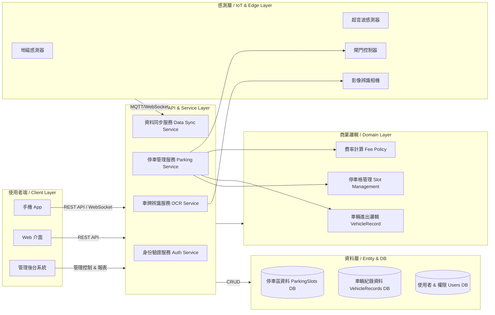
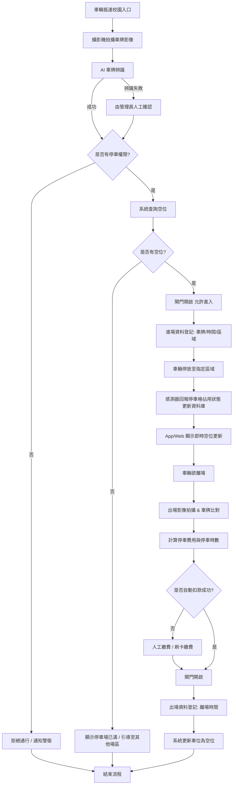
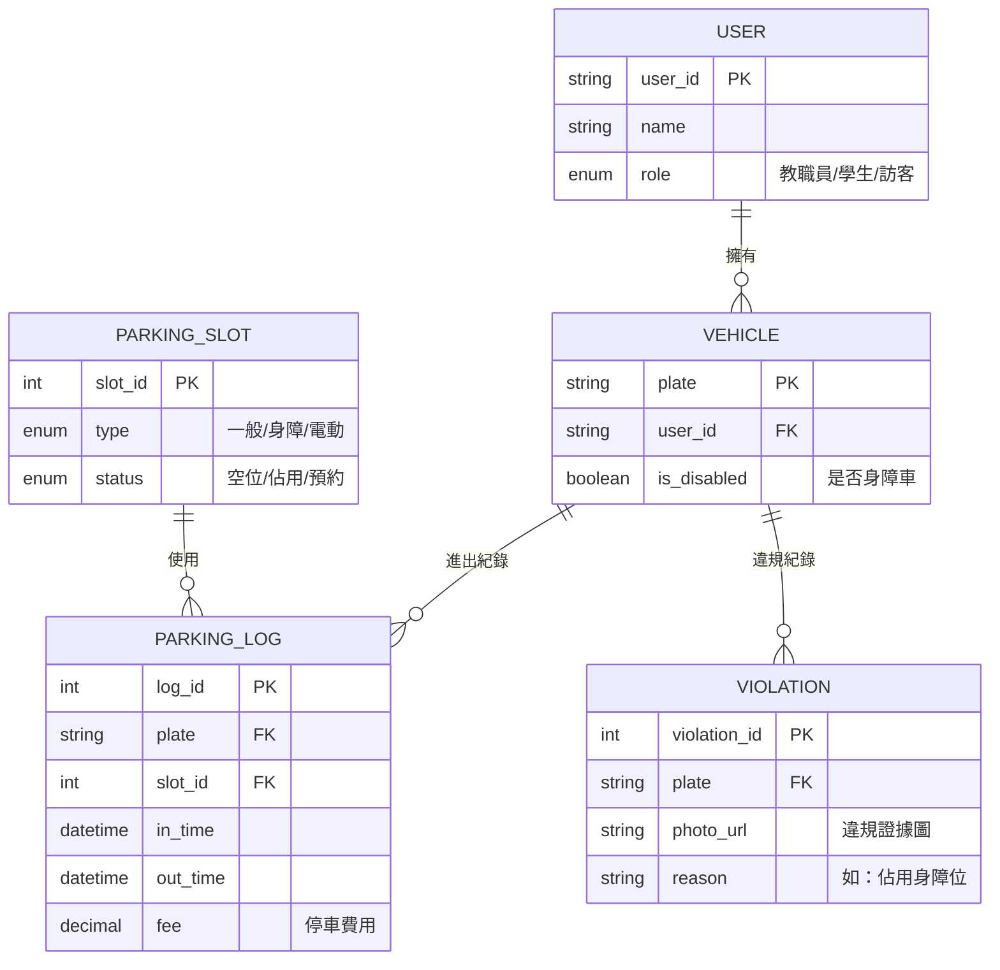
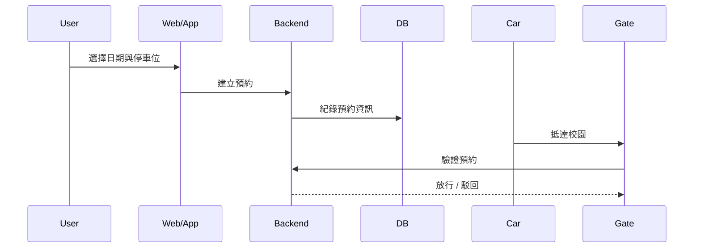
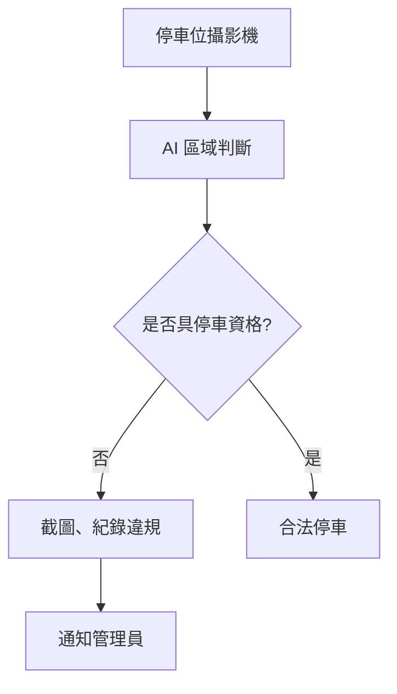
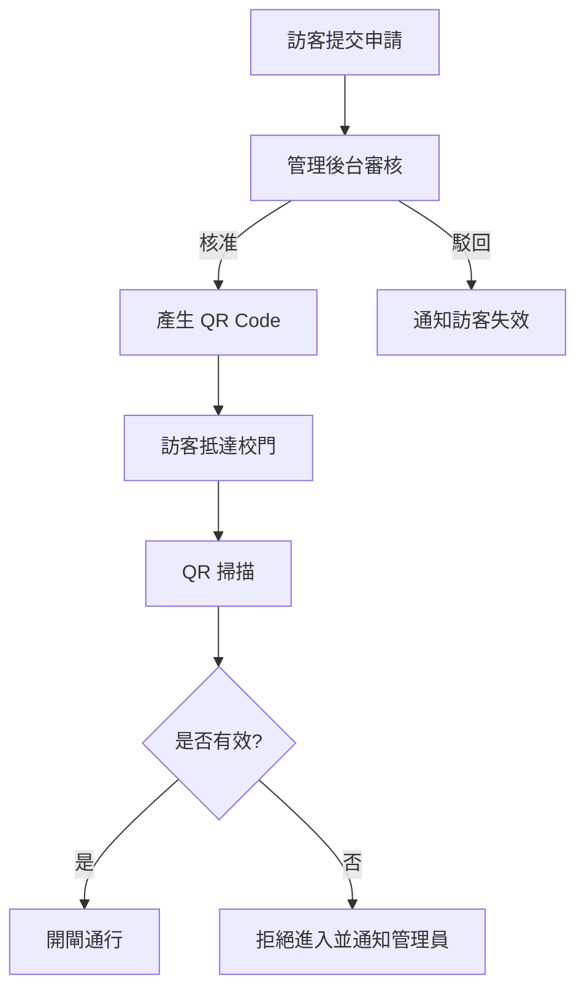
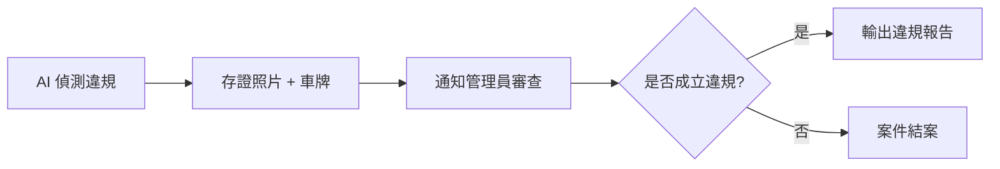
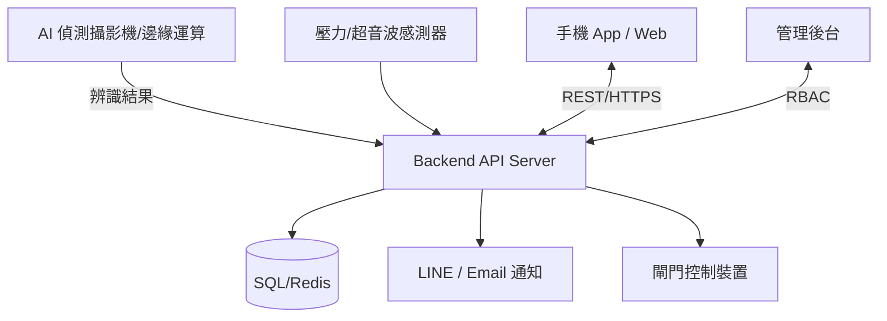

### 軟體工程期末報告 11224213林巧芝 11224216林品妤


# 🅿️ 校園停車場管理系統 Campus Parking Management System

目標:提供校園停車位管理、自動車牌辨識、學生/教職員車位控管與違規偵測，提高校園交通效率與安全性。
採用前後端分離架構、支援自動停車位監測、進出管控、車牌辨識、空位引導與後台管理等功能。適用於校園環境下安全且高效的停車管理。

# 專案特色

停車位即時狀態監測

車牌辨識進出紀錄與停車計費

校園內導航空位引導系統

後台管理停車資料、權限與報表

行動裝置／Web UI 查詢與操作


---


# 🚀 系統功能 Features

| 模組 | 內容 |
|------|------|
| 車位預約系統 | 進場前預約車位、保留時間控管 |
| QR Code 訪客驗證 | 訪客線上申請、QR Gate 驗證通行 |
| 影像違規蒐證 | 偵測佔用障礙者車位、自動存證 |


| 模組 | 內容 |
|------|------|
| 車輛身份辨識 | 使用車牌辨識 (ANPR / YOLO / EasyOCR) |
| 停車位管理 | 即時監控停車格是否佔用 |
| 許可證控管 | 教職員、學生、訪客權限管理 |
| 收費管理 (可選) | 計時收費、錢包儲值、繳費紀錄 |
| 違規偵測 | 未授權車輛、停車格佔用警示 |
| 查詢報表 | 車位統計、流量趨勢、事件紀錄 |

---

# 🧱 整體系統架構圖（System Architecture Diagram）



---


# 🧩 技術堆疊 Tech Stack

| 領域 | 技術選項 |
|------|---------|
| 前端 | React / Vue / Flutter Web |
| 後端 | Node.js / Python FastAPI / Java Spring Boot |
| AI 辨識 | YOLOv8 + OCR，或 OpenALPR |
| 資料庫 | MySQL / PostgreSQL + Redis |
| Edge Device | NVIDIA Jetson / 樹莓派 + USB Camera |
| 通知 | LINE Notify / Firebase |
| 部署 | Docker + Kubernetes / Nginx |

---

# 📌 主要流程 System Workflow

### 1️⃣ 車輛入場流程



### 2️⃣ 車位佔用偵測

* Ultrasonic Sensor / Camera AI
* 偵測異常即回報後台

### 3️⃣ 違規處理流程

* 未註冊車牌 → 自動記錄並通知管理員
* 重複占位或超時 → 系統警告

---


## 📂 資料庫 ER Model 




## 📦 功能模組分工 (開發任務)

| 模組 | 工作項目 |
|------|---------|
| AI車牌辨識 | 影像處理、模型訓練/API化 |
| 後端 API | 車牌驗證、狀態管理 CRUD |
| 控制裝置 | 閘門、LED、壓力感測控制 |
| 前端 | 車位地圖、權限設定、違規查詢 |
| 資安 | 權限隔離、RBAC、HTTPS、Log |

---

## 🔒 權限與角色設計

| 角色 | 權限 |
|------|------|
| Admin | 全部管理、報表分析 |
| Staff | 車位管理、違規開單 |
| Student | 查詢車位、查看自己紀錄 |
| Visitor | 申請進出 |

---

### 🛜 車位預約系統

* 提供學生與教職員提前預約車位
* app / web 即時顯示剩餘車位
* 可設定保留時間，若超時未入場則取消
* 支援臨停與長期配額車位
* 流程：選車位 → 設定時間 → QR 入場驗證



---

### 🎫 QR Code 訪客驗證

* 訪客可線上申請停車通行證
* 管理員審核後簽發 QR Code
* 入場時掃描 QR 自動辨識
* 車牌不在系統也能通行

資料表新增：VisitorPass

| 欄位        | 說明                        |
| --------- | ------------------------- |
| passID    | 訪客憑證 ID PK                |
| name      | 訪客姓名                      |
| plate     | 車牌或暫無                     |
| validTime | 有效時間                      |
| QRToken   | 一次性 QR 亂碼                 |
| status    | pending / approved / used |

---

### 🔍 影像違規蒐證 (佔用身障車位)

* AI 偵測特定標線與標誌
* 車輛停入後比對車主身份是否符合資格
* 違規自動截圖、上傳證據並通知管理員

違規判斷邏輯：
1️⃣ 影像辨識確認停車格屬性（身障 / 電動 / 教職員專用）
2️⃣ 辨識車牌 → 查權限
3️⃣ 若不符資格 → 記錄違規
4️⃣ 管理員審查後匯出 PDF 報告（含違規證據）



---


### 🔹 QR 訪客驗證審核流程



---

### 🔹 違規蒐證審查流程（管理端視角）



---

### 🧱 系統部署架構圖（含 IoT 與雲端）




---

# 📎 專案目錄
```bash
CampusParking/
├─ src/
│  ├─ Parking.Web/              # 前端 UI (Vue 或 React)
│  │  └─ 包含：車位地圖、使用者預約介面、管理後台
│  │
│  ├─ Parking.Server/           # 後端 API 主程式 (Node.js / Python / C#)
│  │  ├─ Controllers/           # 接收請求 (如：進場、出場、查詢)
│  │  ├─ Services/              # 業務邏輯 (如：計費公式、違規自動判定)
│  │  └─ Models/                # 資料庫對應物件 (Entity)
│  │
│  ├─ Parking.AI/               # AI 辨識模組
│  │  └─ 包含：車牌辨識 (OCR)、違規截圖自動上傳功能
│  │
│  └─ Parking.Infrastructure/   # 基礎設施
│     └─ 包含：資料庫連接、LINE/Email 通知發送
│
└─ docs/                        
```

