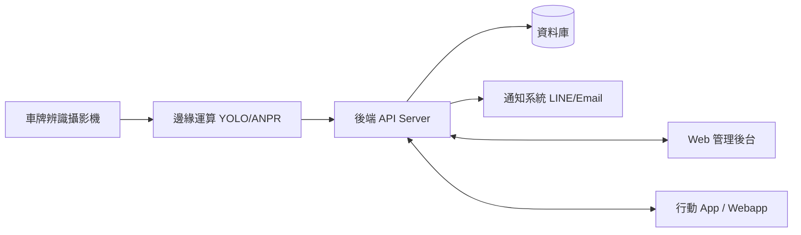
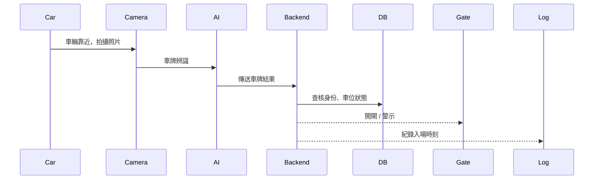
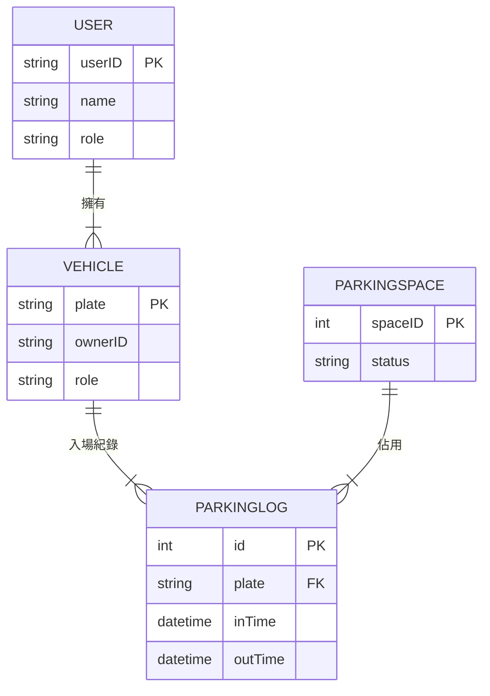

## 軟體工程期末報告 11224213林巧芝 11224216林品妤

### 主題:校園停車場管理系統
目標:提供校園停車位管理、自動車牌辨識、學生/教職員車位控管與違規偵測，提高校園交通效率與安全性。

## 校園停車常見問題問題包括：

效率低下：進出校園需人工核對停車證，導致尖峰時段大門塞車。

資訊不透明：學生與教職員無法即時得知哪區停車場還有空位。

管理漏洞：外來車輛違規停放、車位超量佔用。


# 🅿️ 校園停車場管理系統 Campus Parking Management System

🎯 **目標**  
提供校園停車位管理、自動車牌辨識、學生/教職員車位控管與違規偵測，提高校園交通效率與安全性。

---


## 🚀 系統功能 Features

| 模組 | 內容 |
|------|------|
| 車位預約系統 | 進場前預約車位、保留時間控管 |
| QR Code 訪客驗證 | 訪客線上申請、QR Gate 驗證通行 |
| 影像違規蒐證 | 偵測佔用障礙者車位、自動存證 |


| 模組 | 內容 |
|------|------|
| 車輛身份辨識 | 使用車牌辨識 (ANPR / YOLO / EasyOCR) |
| 停車位管理 | 即時監控停車格是否佔用 |
| 許可證控管 | 教職員、學生、訪客權限管理 |
| 收費管理 (可選) | 計時收費、錢包儲值、繳費紀錄 |
| 違規偵測 | 未授權車輛、停車格佔用警示 |
| 查詢報表 | 車位統計、流量趨勢、事件紀錄 |

---

## 🏗️ 系統架構 System Architecture



---

## 🧩 技術堆疊 Tech Stack

| 領域 | 技術選項 |
|------|---------|
| 前端 | React / Vue / Flutter Web |
| 後端 | Node.js / Python FastAPI / Java Spring Boot |
| AI 辨識 | YOLOv8 + OCR，或 OpenALPR |
| 資料庫 | MySQL / PostgreSQL + Redis |
| Edge Device | NVIDIA Jetson / 樹莓派 + USB Camera |
| 通知 | LINE Notify / Firebase |
| 部署 | Docker + Kubernetes / Nginx |

---

## 📌 主要流程 System Workflow

### 1️⃣ 車輛入場流程


### 2️⃣ 車位佔用偵測
- Ultrasonic Sensor / Camera AI
- 偵測異常即回報後台

### 3️⃣ 違規處理流程
- 未註冊車牌 → 自動記錄並通知管理員
- 重複占位或超時 → 系統警告

---

## 📂 資料庫 ER Model (簡化版)



---

## 📦 功能模組分工 (開發任務)

| 模組 | 工作項目 |
|------|---------|
| AI車牌辨識 | 影像處理、模型訓練/API化 |
| 後端 API | 車牌驗證、狀態管理 CRUD |
| 控制裝置 | 閘門、LED、壓力感測控制 |
| 前端 | 車位地圖、權限設定、違規查詢 |
| 資安 | 權限隔離、RBAC、HTTPS、Log |

---

## 🔒 權限與角色設計

| 角色 | 權限 |
|------|------|
| Admin | 全部管理、報表分析 |
| Staff | 車位管理、違規開單 |
| Student | 查詢車位、查看自己紀錄 |
| Visitor | 申請進出 |

---

## 🧪 測試與驗收
- 單元測試：API、AI 模型準確率
- 系統測試：入退場流程、車位同步
- 效能測試：高峰期壓力測試
- UAT：實際校園測試，使用者回饋

---

## 📌 未來擴充
- 🛜 車位預約系統  
- 🔋 電動車充電位管理  
- 🎫 QR Code 訪客驗證  
- 🔍 影像違規蒐證 (佔用身障車位等)

---

## 📎 專案目錄建議
```bash
CampusParkingSystem/
├─ backend/
├─ frontend/
├─ ai-recognition/
├─ docs/
└─ infra/
```


