### 軟體工程期末報告 11224213林巧芝 11224216林品妤


# 🅿️ 校園停車場管理系統 Campus Parking Management System

目標:提供校園停車位管理、自動車牌辨識、學生/教職員車位控管與違規偵測，提高校園交通效率與安全性。
採用前後端分離架構、支援自動停車位監測、進出管控、車牌辨識、空位引導與後台管理等功能。適用於校園環境下安全且高效的停車管理。

# 專案特色

停車位即時狀態監測

車牌辨識進出紀錄與停車計費

校園內導航空位引導系統

後台管理停車資料、權限與報表

行動裝置／Web UI 查詢與操作


---


# 🚀 系統功能 Features

| 模組 | 內容 |
|------|------|
| 車位預約系統 | 進場前預約車位、保留時間控管 |
| QR Code 訪客驗證 | 訪客線上申請、QR Gate 驗證通行 |
| 影像違規蒐證 | 偵測佔用障礙者車位、自動存證 |


| 模組 | 內容 |
|------|------|
| 車輛身份辨識 | 使用車牌辨識 (ANPR / YOLO / EasyOCR) |
| 停車位管理 | 即時監控停車格是否佔用 |
| 許可證控管 | 教職員、學生、訪客權限管理 |
| 收費管理 (可選) | 計時收費、錢包儲值、繳費紀錄 |
| 違規偵測 | 未授權車輛、停車格佔用警示 |
| 查詢報表 | 車位統計、流量趨勢、事件紀錄 |

---

# 🧱 整體系統架構圖（System Architecture Diagram）

```mermaid
graph LR

subgraph ClientLayer[使用者端 / Client Layer]
    U1[手機 App]
    U2[Web 介面]
    U3[管理後台系統]
end

subgraph APILayer[後端應用服務層 / API & Service Layer]
    A1[身份驗證服務 Auth Service]
    A2[停車管理服務 Parking Service]
    A3[車牌辨識服務 OCR Service]
    A4[資料同步服務 Data Sync Service]
end

subgraph DomainLayer[商業邏輯 / Domain Layer]
    D1[車輛進出邏輯 VehicleRecord]
    D2[停車格管理 Slot Management]
    D3[費率計算 Fee Policy]
end

subgraph IoTLayer[感測層 / IoT & Edge Layer]
    I1[地磁感測器]
    I2[超音波感測器]
    I3[影像辨識相機]
    I4[閘門控制器]
end

subgraph DataLayer[資料層 / Entity & DB]
    DB1[(停車區資料 ParkingSlots DB)]
    DB2[(車輛紀錄資料 VehicleRecords DB)]
    DB3[(使用者 & 權限 Users DB)]
end

%% Client <-> API
U1 -->|REST API / WebSocket| APILayer
U2 -->|REST API| APILayer
U3 -->|管理控制 & 報表| APILayer

%% API to DB
APILayer -->|CRUD| DataLayer

%% Service to Domain Logic
APILayer --> DomainLayer

%% IoT reporting
IoTLayer -->|MQTT/WebSocket| A4

%% Parking logic
A2 --> D2
A2 --> D1
A2 --> D3

%% OCR interaction
A3 --> I3

%% Gate signals
A2 --> I4

```



---


# 🧩 技術堆疊 Tech Stack

| 領域 | 技術選項 |
|------|---------|
| 前端 | React / Vue / Flutter Web |
| 後端 | Node.js / Python FastAPI / Java Spring Boot |
| AI 辨識 | YOLOv8 + OCR，或 OpenALPR |
| 資料庫 | MySQL / PostgreSQL + Redis |
| Edge Device | NVIDIA Jetson / 樹莓派 + USB Camera |
| 通知 | LINE Notify / Firebase |
| 部署 | Docker + Kubernetes / Nginx |

---

# 📌 主要流程 System Workflow

### 1️⃣ 車輛入場流程

```mermaid
flowchart TD

A[車輛抵達校園入口] --> B[攝影機拍攝車牌影像]
B --> C[AI 車牌辨識]
C -->|成功| D{是否有停車權限?}
C -->|辨識失敗| B2[由管理員人工確認] --> D

D -->|否| Z[拒絕通行 / 通知警衛] --> END

D -->|是| E[系統查詢空位]
E --> F{是否有空位?}

F -->|否| G[顯示停車場已滿 / 引導至其他場區] --> END

F -->|是| H[閘門開啟 允許進入]
H --> I[進場資料登記: 車牌/時間/區域]
I --> J[車輛停放至指定區域]
J --> K[感測器回報停車格佔用狀態 更新資料庫]
K --> L[App/Web 顯示即時空位更新]

L --> M[車輛欲離場]
M --> N[出場影像拍攝 & 車牌比對]
N --> O[計算停車費用與停車時數]
O --> P{是否自動扣款成功?}

P -->|否| Q[人工繳費 / 刷卡繳費]
Q --> R[閘門開啟]
P -->|是| R[閘門開啟]

R --> S[出場資料登記: 離場時間]
S --> T[系統更新車位為空位]
T --> END[結束流程]

```



### 2️⃣ 車位佔用偵測

* Ultrasonic Sensor / Camera AI
* 偵測異常即回報後台

### 3️⃣ 違規處理流程

* 未註冊車牌 → 自動記錄並通知管理員
* 重複占位或超時 → 系統警告

---


## 📂 資料庫 ER Model (簡化版)

```mermaid
erDiagram
    USER ||--o{ VEHICLE : "owns"
    USER ||--o{ RESERVATION : "makes"
    USER ||--o{ VISITOR_PASS : "applies_for"
    
    VEHICLE ||--o{ PARKING_LOG : "generates"
    VEHICLE ||--o{ VIOLATION : "commits"
    
    PARKING_SLOT ||--o{ PARKING_LOG : "records"
    PARKING_SLOT ||--o{ RESERVATION : "is_booked"
    PARKING_SLOT ||--o1 IOT_SENSOR : "monitored_by"
    
    PARKING_LOG ||--o1 PAYMENT : "settles"
    PARKING_LOG ||--o{ VIOLATION : "logs"

    USER {
        string user_id PK
        string name
        string email
        string password_hash
        enum role "Admin, Staff, Student, Visitor"
        decimal balance "預付卡餘額"
    }

    VEHICLE {
        string plate_number PK
        string user_id FK
        string model
        string color
        enum type "Car, Motorcycle, Electric"
        boolean has_disabled_permit "是否具身障資格"
    }

    PARKING_SLOT {
        int slot_id PK
        string area_zone "如：A區, B區"
        enum slot_type "Regular, Disabled, EV, StaffOnly"
        enum status "Available, Occupied, Reserved, Maintenance"
        float coordinate_x
        float coordinate_y
    }

    IOT_SENSOR {
        string sensor_id PK
        int slot_id FK
        enum sensor_type "Ultrasonic, Magnetic"
        datetime last_heartbeat "最後在線時間"
        float battery_level
    }

    RESERVATION {
        int reservation_id PK
        string user_id FK
        int slot_id FK
        datetime start_time
        datetime end_time
        string qr_token "加密後的QR內容"
        enum status "Pending, Confirmed, Cancelled, Completed"
    }

    PARKING_LOG {
        int log_id PK
        string plate_number FK
        int slot_id FK
        datetime entry_time
        datetime exit_time
        float duration_minutes
    }

    PAYMENT {
        int payment_id PK
        int log_id FK
        decimal amount
        enum method "LinePay, CreditCard, Balance"
        datetime payment_time
        boolean is_success
    }

    VIOLATION {
        int violation_id PK
        int log_id FK
        string plate_number FK
        enum violation_type "Unauthorized_Occupancy, Overtime"
        string evidence_image_url "影像截圖路徑"
        datetime timestamp
        boolean is_processed
    }

    VISITOR_PASS {
        int pass_id PK
        string user_id FK "申請人ID"
        string visitor_name
        string plate_number
        datetime valid_from
        datetime valid_to
        string qr_code_path
    }
```


## 📦 功能模組分工 (開發任務)

| 模組 | 工作項目 |
|------|---------|
| AI車牌辨識 | 影像處理、模型訓練/API化 |
| 後端 API | 車牌驗證、狀態管理 CRUD |
| 控制裝置 | 閘門、LED、壓力感測控制 |
| 前端 | 車位地圖、權限設定、違規查詢 |
| 資安 | 權限隔離、RBAC、HTTPS、Log |

---

## 🔒 權限與角色設計

| 角色 | 權限 |
|------|------|
| Admin | 全部管理、報表分析 |
| Staff | 車位管理、違規開單 |
| Student | 查詢車位、查看自己紀錄 |
| Visitor | 申請進出 |

---

### 🛜 車位預約系統

* 提供學生與教職員提前預約車位
* app / web 即時顯示剩餘車位
* 可設定保留時間，若超時未入場則取消
* 支援臨停與長期配額車位
* 流程：選車位 → 設定時間 → QR 入場驗證

```mermaid
sequenceDiagram
User ->> Web/App: 選擇日期與停車位
Web/App ->> Backend: 建立預約
Backend ->> DB: 紀錄預約資訊
Car ->> Gate: 抵達校園
Gate ->> Backend: 驗證預約
Backend -->> Gate: 放行 / 駁回
```



---

### 🎫 QR Code 訪客驗證

* 訪客可線上申請停車通行證
* 管理員審核後簽發 QR Code
* 入場時掃描 QR 自動辨識
* 車牌不在系統也能通行

資料表新增：VisitorPass

| 欄位        | 說明                        |
| --------- | ------------------------- |
| passID    | 訪客憑證 ID PK                |
| name      | 訪客姓名                      |
| plate     | 車牌或暫無                     |
| validTime | 有效時間                      |
| QRToken   | 一次性 QR 亂碼                 |
| status    | pending / approved / used |

---

### 🔍 影像違規蒐證 (佔用身障車位)

* AI 偵測特定標線與標誌
* 車輛停入後比對車主身份是否符合資格
* 違規自動截圖、上傳證據並通知管理員

違規判斷邏輯：
1️⃣ 影像辨識確認停車格屬性（身障 / 電動 / 教職員專用）
2️⃣ 辨識車牌 → 查權限
3️⃣ 若不符資格 → 記錄違規
4️⃣ 管理員審查後匯出 PDF 報告（含違規證據）

```mermaid
flowchart TD
    Cam[停車位攝影機] --> AI[AI 區域判斷]
    AI --> Check{是否具停車資格?}
    Check -- 否 --> Log[截圖、紀錄違規]
    Log --> Notify[通知管理員]
    Check -- 是 --> OK[合法停車]
```



---


### 🔹 QR 訪客驗證審核流程

```mermaid
flowchart TD
    A[訪客提交申請] --> B[管理後台審核]
    B -->|核准| C[產生 QR Code]
    B -->|駁回| D[通知訪客失效]

    C --> E[訪客抵達校門]
    E --> F[QR 掃描]
    F --> G{是否有效?}
    G -->|是| H[開閘通行]
    G -->|否| I[拒絕進入並通知管理員]
```



---

### 🔹 違規蒐證審查流程（管理端視角）

```mermaid
flowchart LR
    Cam[AI 偵測違規] --> Log[存證照片 + 車牌]
    Log --> Notify[通知管理員審查]
    Notify --> Check{是否成立違規?}
    Check -->|是| Report[輸出違規報告]
    Check -->|否| Close[案件結案]
```



---

### 🧱 系統部署架構圖（含 IoT 與雲端）

```mermaid
flowchart TB
    CamAI[AI 偵測攝影機/邊緣運算] -->|辨識結果| APIServer[Backend API Server]
    Sensor[壓力/超音波感測器] --> APIServer
    App[手機 App / Web] <-->|REST/HTTPS| APIServer
    Admin[管理後台] <-->|RBAC| APIServer
    APIServer --> DB[(SQL/Redis)]
    APIServer --> Notify[LINE / Email 通知]
    APIServer --> Gate[閘門控制裝置]
```




---

# 📎 專案目錄
```bash
CampusParkingSystem/
├─ src/
│  ├─ Parking.Api/                  # 表現層 (Presentation Layer - RESTful API)
│  │  ├─ Controllers/               # 車位查詢、預約、訪客申請、違規申訴 API
│  │  ├─ Filters/                   # 權限驗證 (JWT/RBAC)、例外處理
│  │  ├─ Middleware/                # 請求日誌記錄、效能監控
│  │  └─ Program.cs                 # 進入點與相依性注入 (DI) 配置
│  │
│  ├─ Parking.Application/          # 應用服務層 (Application Service Layer)
│  │  ├─ Interfaces/                # 定義 Repository、AI 辨識、通知服務介面
│  │  ├─ Services/                  # 停車計費引擎、預約排程邏輯、違規判定邏輯
│  │  ├─ DTOs/                      # Data Transfer Objects (Request/Response)
│  │  └─ Validators/                # FluentValidation (例如：車牌格式檢查)
│  │
│  ├─ Parking.Domain/               # 核心領域層 (Core Domain Layer)
│  │  ├─ Entities/                  # Vehicle, ParkingSlot, User, ViolationRecord
│  │  ├─ Enums/                     # SlotStatus (Available, Occupied, Reserved)
│  │  ├─ ValueObjects/              # PlateNumber, Money, GeoLocation
│  │  └─ DomainEvents/              # 定義事件：如「車輛非法闖入」、「車位已滿」
│  │
│  ├─ Parking.Infrastructure/       # 基礎設施層 (Infrastructure Layer)
│  │  ├─ DbContexts/                # EF Core / Prisma 資料庫上下文
│  │  ├─ Repositories/              # 資料庫實作 (SQL Server/PostgreSQL)
│  │  ├─ ExternalServices/          # 第三方整合：LINE Notify, Firebase Auth
│  │  └─ AI_OCR/                    # YOLOv8/v11 模型封裝與影像預處理實作
│  │
│  ├─ Parking.EdgeDevice/           # 邊緣運算與 IoT 控制 (Raspberry Pi/Jetson)
│  │  ├─ GateControl/               # GPIO 控制閘門升降程式碼
│  │  ├─ SensorPolling/             # 超音波/地磁感測器數據採集 (MQTT)
│  │  └─ CameraStream/              # RTSP 影像串流與截圖傳送
│  │
│  └─ Parking.Dashboard/            # 管理前端 (Web/Mobile)
│     ├─ src/components/            # 實時車位 2D 地圖、視覺化報表
│     └─ src/store/                 # 狀態管理 (Vuex/Redux)
│
└─ docs/                            # 專案開發文件
   ├─ architecture/                 # 系統架構圖、ERD、Sequence Diagrams
   ├─ api_spec/                     # Swagger / Postman Collection
   └─ deployment/                   # Dockerfile & Docker-compose 配置
```

